# Mapa completo del flujo documental — Mocciaro Soft

> **Fecha:** 2026-05-07
> **Versión:** auditoría sobre commit `1e55567`
> **Propósito:** mapa exhaustivo del modelo de documentos para compararlo con StelOrder y decidir refactor.

⚠ **Disclaimer importante**: el sistema tiene **dos modelos coexistiendo** (legacy y nuevo). Esto está marcado donde corresponde. No es un bug del mapa — es el estado real del código. Resolver esa dualidad es uno de los objetivos del refactor.

---

## 0 · Dualidad de modelos (contexto crítico)

| Modelo | Tablas | Migración | Estado |
|---|---|---|---|
| **Legacy** | `tt_quotes`, `tt_quote_items`, `tt_sales_orders`, `tt_so_items`, `tt_document_items` (legacy híbrido), `tt_document_links`, `tt_oc_parsed` | `schema.sql`, `v2.sql` | **En uso parcial**. Cotizador y compras viejas. |
| **Unificado nuevo** | `tt_documents`, `tt_document_lines`, `tt_document_relations`, `tt_document_configs`, `tt_document_numbering`, `tt_document_events` | v34, **v37**, **v38**, v51, v54 | **Definido pero usado parcialmente**. UI nueva ya lee de acá; varios módulos viejos siguen escribiendo en legacy. |

> Las **OCs del cliente** viven en una **tercera tabla** (`tt_oc_parsed`) que está fuera de los dos modelos. Esa es la principal fuente de confusión que vos detectaste.

---

## 1 · Documentos principales del sistema

### 1.1 Tipos de documento (`tt_documents.doc_type`)

CHECK constraint en v37 admite estos 10 valores:

| `doc_type` | Nombre humano | Dirección | Origen típico |
|---|---|---|---|
| `quote` | Cotización / Presupuesto | sales | Manual o OC importada |
| `sales_order` | Pedido de venta | sales | Derivado de quote |
| `delivery_note` | Albarán / Remito | sales | Derivado de sales_order |
| `invoice` | Factura | sales/purchase | Derivado de delivery_note o sales_order |
| `proforma` | Proforma | sales | Derivado de quote |
| `receipt` | Recibo de cobro | sales | Derivado de invoice |
| `credit_note` | Nota de crédito | sales/purchase | Derivado de invoice |
| `debit_note` | Nota de débito | sales/purchase | Derivado de invoice |
| `purchase_order` | Orden de compra | purchase | Manual |
| `internal` | Documento interno | internal | Manual |

**Subtipos** (`doc_subtype`, libre): `cotizacion`, `presupuesto`, `proforma`, `packing_list`, `oferta`, etc.

### 1.2 Estados (`tt_documents.status`)

CHECK constraint admite 12 valores:

| Status | Significado | Final/transitivo |
|---|---|---|
| `draft` | Borrador editable | Transitivo |
| `issued` | Emitido (numerado y locked) | Transitivo |
| `sent` | Enviado al cliente | Transitivo |
| `accepted` | Aceptado | Transitivo |
| `rejected` | Rechazado | Transitivo |
| `partially_delivered` | Parcialmente entregado | Transitivo |
| `delivered` | Totalmente entregado | Transitivo |
| `partially_invoiced` | Parcialmente facturado | Transitivo |
| `invoiced` | Totalmente facturado | Transitivo |
| `paid` | Cobrado/pagado | Casi final |
| `cancelled` | Cancelado | **Final** |
| `voided` | Anulado fiscalmente | **Final** |

### 1.3 Campos de cabecera (`tt_documents`)

**Obligatorios:**
- `id` (UUID)
- `company_id` (FK)
- `doc_type` (CHECK)
- `direction` (`sales | purchase | internal`)
- `currency_code`
- `status` (default `draft`)
- `created_by`, `created_at`, `updated_at`

**Numeración (se llenan al emitir):**
- `doc_number` (BIGINT) · `doc_year` (INT) · `doc_code` (TEXT, renderizado desde template) · `issued_at`

**Contraparte (cliente o proveedor):**
- `counterparty_type` (`customer | supplier | internal | other`)
- `counterparty_id`, `counterparty_name`, `counterparty_tax_id`, `counterparty_email`, `counterparty_address` (snapshot al emitir)

**Importes:**
- `subtotal`, `discount_total`, `tax_total`, `total`, `exchange_rate`

**Fechas:**
- `doc_date`, `valid_until` (cotizaciones), `due_date` (facturas)

**Referencias externas:**
- `external_ref` (libre)
- `customer_po_number` (número de OC del cliente)

**Texto:**
- `notes` (público, va al PDF) · `internal_notes` (privado)

**Metadata:**
- `metadata` (JSONB libre)

**Cancelación / lock:**
- `cancelled_at`, `cancelled_reason`, `locked` (BOOLEAN)

### 1.4 Líneas (`tt_document_lines`)

Modelo nuevo. Una línea es snapshot del producto al momento + cálculos.

**Campos clave:**
- `product_id` (soft FK — sobrevive borrado)
- `product_sku`, `product_name` (snapshot)
- `description`, `notes`, `unit`
- `quantity`, `unit_price`, `discount_pct`, `discount_amount`, `tax_rate`, `tax_amount`
- `subtotal`, `total`
- `attributes` (JSONB)
- `image_url`
- **Para derivación**: `source_line_id` (FK a la línea origen), `quantity_delivered`, `quantity_invoiced`

**Protección:** triggers en v38 bloquean INSERT/DELETE en docs con `status != 'draft'`. Solo permite UPDATE de `quantity_delivered` y `quantity_invoiced`.

### 1.5 Líneas legacy (`tt_document_items`)

Modelo viejo coexistente. Tiene más campos operativos:
- `qty_reserved, qty_delivered, qty_invoiced, qty_received, qty_cancelled`
- `requires_po, po_status, po_document_id` (cross-purchase para items que disparan compra)
- `warehouse_id, stock_at_creation`
- `oc_line_ref` (referencia a línea de OC del cliente)
- `internal_description`, `cost_snapshot`

### 1.6 Tabla de tablas relacionadas

| Tabla | Rol | Modelo |
|---|---|---|
| `tt_documents` | Cabecera unificada | Nuevo |
| `tt_document_lines` | Líneas (con derivación trazable) | Nuevo |
| `tt_document_items` | Líneas operativas legacy | Legacy |
| `tt_document_item_components` | Descomposición de kits | Legacy |
| `tt_document_relations` | Cadena de derivación tipada | Nuevo |
| `tt_document_links` | Vínculos viejos (parent/child genérico) | Legacy |
| `tt_document_configs` | Plantillas y políticas por empresa × tipo | Nuevo |
| `tt_document_numbering` | Contadores atómicos | Nuevo |
| `tt_document_events` | Bitácora append-only | Nuevo |
| `tt_quotes` / `tt_quote_items` | Cotizaciones legacy | Legacy |
| `tt_sales_orders` / `tt_so_items` | Pedidos legacy | Legacy |
| `tt_purchase_orders` / `tt_po_items` | Órdenes de compra | Legacy |
| `tt_invoice_payments` | Cobros/pagos contra facturas | Legacy |
| `tt_oc_parsed` | OCs del cliente parseadas por IA | **Tercera vía** |
| `tt_stock_reservations` | Reservas de stock por documento | Nuevo (v54) |

### 1.7 Eventos posibles (`tt_document_events.event_type`)

Append-only, inmutables. 14 tipos:
`created`, `status_changed`, `line_added`, `line_updated`, `line_removed`, `issued`, `sent`, `accepted`, `rejected`, `derived_out`, `derived_in`, `cancelled`, `voided`, `numbered`, `email_sent`, `pdf_generated`.

---

## 2 · Flujo general end-to-end

### 2.1 Camino feliz (cotización manual)

```
[1] Cliente pide presupuesto
        ↓
[2] /cotizador → Nueva cotización
    crea tt_documents (doc_type=quote, status=draft)
        ↓
[3] Agregar líneas (tt_document_lines)
    triggers calculan totales automáticamente
        ↓
[4] Emitir (POST /api/documents/:id/issue)
    fn_issue_document() atómico:
      - asigna doc_number vía fn_next_document_number()
      - renderiza doc_code desde template
      - pasa status: draft → issued
      - graba issued_at, locked=true
      - graba evento "issued" + "numbered"
        ↓
[5] Enviar al cliente (POST /api/documents/:id/send)
    status: issued → sent
        ↓
[6] Cliente acepta (manual)
    status: sent → accepted
        ↓
[7] Derivar a Pedido (POST /api/documents/:id/derive)
    fn_derive_document() atómico:
      - crea tt_documents (doc_type=sales_order, status=draft)
      - copia líneas con source_line_id apuntando atrás
      - inserta tt_document_relations(quote→sales_order, type='converted_to')
      - reserva stock (tt_stock_reservations.status=active)
        ↓
[8] Emitir Pedido → status: issued
        ↓
[9] Derivar a Albarán (delivery_note)
    consume reservas (status='consumed')
    descuenta stock real
        ↓
[10] Albarán entregado → status: delivered
     pedido auto-pasa a partially_delivered o delivered
        ↓
[11] Derivar a Factura (invoice)
     pedido y/o albarán pasa a partially_invoiced o invoiced
        ↓
[12] Emitir factura (numeración fiscal)
        ↓
[13] Registrar cobro (tt_invoice_payments)
     factura pasa a paid cuando suma de pagos == total
```

### 2.2 Camino feliz (cotización desde OC)

```
[1] Cliente manda OC en PDF
        ↓
[2] /ventas/importar-oc → Subir OC
    almacena PDF en bucket "client-pos"
    crea tt_oc_parsed (status=uploaded)
        ↓
[3] Parsear con IA (claude / gpt-4o)
    extrae items, total, número OC
    actualiza tt_oc_parsed (status=parsed)
        ↓
[4] Match con cotización existente
    matched_quote_id ← cotización elegida
    detecta discrepancias (qty / precio)
    status=matched
        ↓
[5] Validar discrepancias (manual)
    status=validated
        ↓
[6] Convertir en pedido (POST /api/oc/convert-to-order)
    crea sales_order con datos de la OC
    vincula al quote matcheado
    status=converted, document_id ← pedido
        ↓
[7-13] Igual que camino feliz desde paso [9]
```

### 2.3 Ramas alternativas

#### 2.3.1 OC sin cotización previa
- En `/ventas/importar-oc`, no se elige cotización.
- Acción "Generar cotización desde esta OC" (`POST /api/oc/create-quote`) crea un `tt_documents(doc_type=quote)` con los items de la OC. Se auto-matchea.

#### 2.3.2 Pedido parcial
- Al derivar a albarán, se ingresan cantidades menores que las del pedido.
- `tt_document_lines.quantity_delivered < quantity` → pedido status: `partially_delivered`.
- Permite múltiples albaranes hasta sumar el total → `delivered`.

#### 2.3.3 Albaranes múltiples (split delivery)
- Un sales_order genera N delivery_notes.
- `tt_document_relations` tiene N filas (`relation_type=delivered_as`).
- Cada albarán tiene sus propias líneas con `source_line_id` → línea original del pedido.

#### 2.3.4 Facturación parcial
- Una factura cubre parte del pedido o de un albarán.
- `quantity_invoiced` se acumula; doc origen pasa a `partially_invoiced` hasta completar.

#### 2.3.5 Facturación agrupada (consolidada)
- Una factura agrupa varios albaranes (mismo cliente).
- Múltiples filas en `tt_document_relations` (`source = albaranes`, `target = factura`, `type='invoiced_as'`).

#### 2.3.6 Pagos múltiples / parciales
- Múltiples filas en `tt_invoice_payments` apuntan a la misma factura.
- Factura pasa a `paid` solo cuando `SUM(payments) >= total`.

#### 2.3.7 Devoluciones (credit_note)
- Se deriva de la factura: `relation_type='amended_by'`.
- Líneas con cantidad negativa o nota de crédito completa.

#### 2.3.8 Cancelación
- `POST /api/documents/:id/cancel` → status `cancelled`.
- Si tenía reservas activas, las libera (`tt_stock_reservations.status='released'`).
- Si tiene derivaciones existentes, falla con error (hay que cancelar la cadena de hijos primero).

#### 2.3.9 Anulación fiscal (voided)
- Solo aplica a facturas emitidas.
- Status `voided` es **final** — no se puede revertir.
- Requiere emitir credit_note compensatoria.

---

## 3 · Puertas de entrada al flujo

### 3.1 Cotización manual
- **Ruta UI:** `/cotizador → Nueva`
- **Endpoint:** `POST /api/documents` con `{ doc_type: 'quote', direction: 'sales', counterparty_id: cliente }`
- **Crea:** `tt_documents` en `draft`
- **Sin attachments obligatorios.**
- **Quien pueda crear:** users con rol `admin` (RLS).

### 3.2 Cotización generada desde OC importada

**Ruta UI:** `/ventas/importar-oc` (módulo aparte, esta es la queja del usuario).

**Flujo de parseo:**
1. Usuario sube PDF al bucket `client-pos`.
2. Se crea `tt_oc_parsed` (campos): `id`, `file_name`, `file_url`, `company_id`, `parsed_at`, `status='uploaded'`.
3. Endpoint `POST /api/oc/parse` invoca IA (Claude o GPT-4o) → extrae:
   - `numero_oc` (string)
   - `cliente` (intentando match con `tt_clients`)
   - `items[]` con `sku`, `qty`, `unit_price`, `description`
   - `total`
4. Actualiza `tt_oc_parsed`:
   - `status='parsed'`
   - `confidence_score` (0..1)
   - `ai_provider` (`claude | gpt-4o`)
   - `ai_discrepancies` (array `{ severity, detail }`)

**Match con cotización (opcional):**
- Si el usuario eligió `quoteDocumentId` antes de subir, el endpoint compara items y arma `ai_discrepancies`.
- Si no eligió cotización: la OC queda en estado "pendiente match con cotización".

**Crear cotización desde OC:**
- Acción "Generar cotización desde esta OC" (`POST /api/oc/create-quote`):
  - Crea `tt_documents(doc_type=quote, doc_subtype='cotizacion', status=draft)`.
  - Crea líneas en `tt_document_items` (legacy) **o** `tt_document_lines` (depende del path).
  - Setea `tt_oc_parsed.matched_quote_id = nuevoQuote.id`.
- ⚠ **El PDF de la OC NO queda como attachment de la cotización** — queda en `tt_oc_parsed`.

**Convertir OC en pedido:**
- `POST /api/oc/convert-to-order`:
  - Crea `tt_documents(doc_type=sales_order)`.
  - `customer_po_number = oc.numero_oc`.
  - Vincula al quote matcheado vía `tt_document_relations`.

### 3.3 Otras puertas (no ventas)

| Puerta | Crea | Donde |
|---|---|---|
| Manual purchase_order | `tt_purchase_orders` (legacy) | `/compras → Nueva` |
| Importar factura (Tango) | `tt_documents(doc_type=invoice)` | `/facturas` |
| Pasarela bancaria | `tt_invoice_payments` | conciliación bancaria |
| SAT (servicio técnico) | `tt_sat_tickets` | `/sat` |

---

## 4 · Relaciones entre documentos

### 4.1 Tipos de relación (`tt_document_relations.relation_type`)

| Relación | Origen → Destino | Significado |
|---|---|---|
| `converted_to` | quote → sales_order | Cotización aceptada generó pedido |
| `delivered_as` | sales_order → delivery_note | Pedido se entrega vía albarán |
| `invoiced_as` | sales_order o delivery_note → invoice | Se factura |
| `paid_by` | invoice → receipt | Cobrado |
| `amended_by` | invoice → credit_note / debit_note | Corrección |
| `cancelled_by` | document → document | Cancelación referencial |
| `copied_from` | template → document | Duplicación |
| `split_into` | document → varios | Split de un doc |
| `merged_into` | varios → uno | Consolidación |

### 4.2 Cadena canónica

```
quote ──converted_to──→ sales_order ──delivered_as──→ delivery_note ──invoiced_as──→ invoice ──paid_by──→ receipt
                              │                                                            │
                              └──invoiced_as (directa, sin albarán) ──────────────────────┘
                                                                                            │
                                                                                            └──amended_by──→ credit_note
```

### 4.3 Herencia de campos

Al derivar (vía `fn_derive_document`):
- **Hereda:** `company_id`, `currency_code`, `counterparty_*`, `customer_po_number`, `external_ref`, `notes`.
- **Heredan las líneas:** `product_id`, `product_sku`, `product_name`, `description`, `unit_price`, `discount_pct`, `tax_rate` (snapshot).
- **NO hereda:** `doc_number`, `doc_code`, `status` (siempre arranca `draft`), `issued_at`.
- **Trazabilidad:** cada `tt_document_lines.source_line_id` apunta a la línea origen.

### 4.4 Documentos que pueden existir SIN otro

| Documento | ¿Necesita predecesor? |
|---|---|
| `quote` | No — puerta de entrada |
| `purchase_order` | No — puerta de entrada |
| `sales_order` | **Opcional** — puede crearse directo (skip cotización) |
| `delivery_note` | **Opcional** — puede emitirse sin pedido (entrega de muestra) |
| `invoice` | **Opcional** — factura directa permitida (sin pedido ni albarán) |
| `credit_note` | **Sí** — necesita factura origen |
| `debit_note` | **Sí** — necesita factura origen |
| `receipt` | **Sí** — necesita factura origen |
| `proforma` | No — puede generarse standalone |

---

## 5 · Reglas de negocio críticas

### 5.1 Transiciones de estado permitidas

Definidas en `src/lib/schemas/documents.ts → ALLOWED_TRANSITIONS`:

```
draft               → issued, cancelled
issued              → sent, accepted, rejected, partially_delivered, delivered,
                      partially_invoiced, invoiced, paid, cancelled, voided
sent                → accepted, rejected, partially_delivered, delivered,
                      partially_invoiced, invoiced, paid, cancelled, voided
accepted            → partially_delivered, delivered, partially_invoiced,
                      invoiced, paid, cancelled, voided
rejected            → cancelled
partially_delivered → delivered, partially_invoiced, invoiced, cancelled, voided
delivered           → partially_invoiced, invoiced, paid, voided
partially_invoiced  → invoiced, paid, voided
invoiced            → paid, voided
paid                → voided
cancelled           → (final)
voided              → (final)
```

Cualquier transición fuera de esta tabla → error 400 en `canTransition()`.

### 5.2 Validaciones a nivel DB (v38 hardening)

- **`fn_protect_lines_on_locked_doc()`**: bloquea INSERT/DELETE de líneas en docs con `status != 'draft'`.
- **Excepción:** UPDATE de `quantity_delivered` y `quantity_invoiced` está permitido (lo hacen las derivaciones).
- **`tt_document_events`** es inmutable: REVOKE UPDATE, DELETE para `authenticated`. Solo INSERT.
- **Numeración atómica:** `fn_next_document_number()` usa `INSERT ... ON CONFLICT DO UPDATE` para evitar saltos en concurrencia.
- **`fn_recompute_document_totals()`**: trigger after INSERT/DELETE/UPDATE en `tt_document_lines` recalcula totales del padre.

### 5.3 Reglas de derivación (`canDerive`)

| Origen | Destinos permitidos |
|---|---|
| `quote` | `sales_order`, `proforma` |
| `sales_order` | `delivery_note`, `invoice`, `purchase_order` (para items con `requires_po=true`) |
| `delivery_note` | `invoice` |
| `invoice` | `receipt`, `credit_note`, `debit_note` |
| `purchase_order` | `delivery_note` (recepción), `invoice` (factura compra) |

**Cantidades remanentes:** `fn_derive_document()` chequea que `quantity_delivered` (o `_invoiced`) **no exceda** `quantity` original.

### 5.4 Stock

- **Reserva** al pasar quote → sales_order: `reserveStockForDocument()` crea filas `active`.
- **Consumo** al emitir delivery_note: `consumeStockForDelivery()` pasa reservas a `consumed` y descuenta `tt_inv_stock`.
- **Liberación** al cancelar: `releaseStockForDocument()` pasa reservas a `released`.
- **Constraint:** sin reserva, un albarán puede emitir igual (no es bloqueante hoy — modo `non-strict`).

### 5.5 Numeración fiscal

- Configurable por empresa × `doc_type`.
- Template default: `{type}-{prefix}.{year}.{number:6}` → `FAC-TT.2026.000123`.
- `reset_yearly=true` → contador vuelve a 1 cada año fiscal.
- **Sin saltos** (porque es atómico): si cancelás un draft antes de emitir, el número no se consume.

### 5.6 Lock post-emisión

Cuando un documento pasa a `issued`:
- `locked = true`.
- No se pueden modificar líneas.
- No se puede cambiar `counterparty_*`.
- Solo se puede: agregar eventos, derivar, cancelar.

### 5.7 RLS (Row-Level Security)

- `tt_documents` SELECT: requiere `app_can_see_company(company_id)` (multi-empresa silos).
- INSERT/UPDATE/DELETE: requiere también `fn_is_admin_user()`.
- `tt_document_lines`, `tt_document_relations`, `tt_document_events`: heredan vía documento padre.
- `service_role` bypassea RLS (lo usan los endpoints API).

---

## 6 · Excepciones y casos especiales

### 6.1 Factura directa (sin albarán ni pedido)
- Se crea `tt_documents(doc_type=invoice)` directamente.
- No tiene `tt_document_relations` apuntando hacia atrás.
- Caso típico: servicios profesionales, suscripciones.

### 6.2 Pedido sin cotización
- Permitido. Se crea `sales_order` directamente.
- Sin `tt_document_relations` upstream.
- Caso típico: cliente recurrente que pide siempre lo mismo.

### 6.3 Cotización rechazada
- `status = rejected`. **Final salvo cancelación**.
- No se puede derivar a sales_order.
- Se puede *clonar* (`copied_from`) y editar para mandar nueva versión.

### 6.4 OC con discrepancias
- `tt_oc_parsed.ai_discrepancies` array de `{severity, detail}`.
- Severities: `low`, `medium`, `high`.
- Status `matched` se queda hasta que el usuario marca como `validated` manualmente.
- ⚠ No bloquea conversión a pedido — el usuario es responsable de aceptar las discrepancias.

### 6.5 Pago parcial
- `tt_invoice_payments` permite N filas por factura.
- Factura solo pasa a `paid` cuando `SUM(payments) >= total - tolerance` (tolerance default 0.01).

### 6.6 Devolución / recobro
- Devolución: se emite `credit_note` derivada de `invoice`.
- Recobro: se registra `tt_invoice_payments` con monto positivo después de un fallo bancario.

### 6.7 Cancelación con derivaciones
- Si el documento tiene hijos derivados, `cancel` falla.
- Hay que cancelar primero la cadena (factura → albarán → pedido → cotización).

### 6.8 OC en español, inglés, alemán o portugués
- El parseo IA detecta el idioma y normaliza al castellano interno.
- Se guarda el texto original en `tt_oc_parsed.metadata.raw_text`.

### 6.9 Documento sin numeración
- `doc_number IS NULL` cuando `status='draft'`.
- Solo `fn_issue_document` asigna número.
- Si por error se cancela un draft sin emitir, no consume número.

### 6.10 Items que requieren compra (drop-shipping)
- `tt_document_items.requires_po = true`.
- Al confirmar el pedido, se genera automáticamente `purchase_order` para esos items.
- Trazabilidad cruzada: `tt_document_items.po_document_id` apunta al PO.

### 6.11 Cotización legacy vs nueva
- ⚠ Hay cotizaciones en `tt_quotes` (legacy) Y en `tt_documents(doc_type=quote)`.
- La UI nueva lee de `tt_documents` pero algunos endpoints viejos siguen escribiendo en `tt_quotes`.
- **Esta es la principal deuda técnica del sistema**.

---

## 7 · Representación visual

### 7.1 Diagrama de flujo (Mermaid)

```mermaid
flowchart TD
    classDef entry fill:#1E2330,stroke:#FF6600,stroke-width:2px,color:#F0F2F5
    classDef doc fill:#141820,stroke:#3B82F6,color:#F0F2F5
    classDef terminal fill:#10B98115,stroke:#10B981,color:#10B981
    classDef ai fill:#FF660015,stroke:#FF6600,stroke-width:1.5px,color:#FF6600
    classDef alt fill:#1E2330,stroke:#F59E0B,color:#F0F2F5

    subgraph ENTRADAS["PUERTAS DE ENTRADA"]
        E1["Cotización manual"]:::entry
        E2["OC del cliente (PDF)"]:::entry
        E3["Pedido directo (cliente recurrente)"]:::entry
        E4["Factura directa (servicios)"]:::entry
        E5["Orden de compra"]:::entry
    end

    E2 --> AI{"IA parsea PDF<br/>tt_oc_parsed"}:::ai
    AI --> Q

    E1 --> Q[("📋 quote<br/>tt_documents")]:::doc
    Q -->|aceptada| SO[("📦 sales_order")]:::doc
    E3 --> SO

    SO -->|reserva stock| RES{{"tt_stock_reservations<br/>(active)"}}:::alt

    SO -->|despachado| DN[("🚚 delivery_note")]:::doc
    DN -->|consume| RES2{{"reservas → consumed<br/>stock real ↓"}}:::alt

    SO -.->|factura directa<br/>sin albarán| INV
    DN -->|facturado| INV[("🧾 invoice")]:::doc
    E4 --> INV

    INV -->|cobrado| PAY[("💰 receipt<br/>tt_invoice_payments")]:::terminal
    INV -->|devolución| CN[("🔁 credit_note")]:::alt

    Q -.->|rechazada| REJ["status=rejected"]:::alt
    SO -.->|cancelado| CANC["status=cancelled<br/>libera stock"]:::alt

    E5 --> PO[("🛒 purchase_order")]:::doc
    PO -->|recibido| PDN[("📥 delivery_note compra")]:::doc
    PDN -->|facturado| PINV[("🧾 invoice compra")]:::doc

    SO -.->|items con requires_po| PO

    style ENTRADAS fill:#0F1218,stroke:#2A3040
```



### 7.2 Tabla comparativa de documentos

| Documento (`doc_type`) | Estados posibles | Transiciones salientes | Origen típico | Destino típico |
|---|---|---|---|---|
| `quote` | draft, issued, sent, accepted, rejected, cancelled, voided | issued→sent→accepted→(deriva); rejected; cancelled | Manual (cotizador) **o** OC parseada | sales_order (derivado) |
| `sales_order` | draft, issued, partially_delivered, delivered, partially_invoiced, invoiced, paid, cancelled, voided | issued→partially_delivered→delivered; →invoiced; →cancelled | Derivado de quote, **o** directo, **o** desde OC | delivery_note, invoice |
| `delivery_note` | draft, issued, delivered, partially_invoiced, invoiced, voided | issued→delivered→invoiced | Derivado de sales_order | invoice |
| `invoice` | draft, issued, sent, partially_invoiced, invoiced, paid, cancelled, voided | issued→sent→paid; →amended_by credit_note; →voided | Derivado de delivery_note **o** sales_order **o** directo | receipt, credit_note |
| `proforma` | draft, issued, sent, cancelled | issued→sent | Derivado de quote **o** directo | (informativo, no obliga) |
| `receipt` | draft, issued, voided | issued→voided | Cobro de invoice | (final) |
| `credit_note` | draft, issued, applied, voided | issued→applied | Derivado de invoice | (compensa invoice) |
| `debit_note` | draft, issued, applied, voided | issued→applied | Derivado de invoice | (suma a invoice) |
| `purchase_order` | draft, issued, sent, confirmed, partially_received, received, partially_invoiced, invoiced, paid, cancelled | igual que sales_order pero direction=purchase | Manual **o** auto desde sales_order (drop-ship) | delivery_note (recepción), invoice (compra) |
| `internal` | draft, issued, cancelled | (uso interno) | Manual | (no deriva) |

### 7.3 Tabla de eventos de creación/modificación/cierre

| Documento | Evento que lo crea | Evento que lo cierra |
|---|---|---|
| `quote` | `POST /api/documents` (manual) o `POST /api/oc/create-quote` (desde OC) | aceptación + derivación a sales_order **o** rejected/cancelled |
| `sales_order` | `POST /api/documents/:quoteId/derive` o `POST /api/oc/convert-to-order` o creación directa | totalmente facturado y entregado, **o** cancelled |
| `delivery_note` | `POST /api/documents/:soId/derive` con `target_type=delivery_note` | totalmente facturado |
| `invoice` | `POST /api/documents/:dnId/derive` con `target_type=invoice` o creación directa | totalmente cobrado (paid) **o** voided |
| `purchase_order` | manual o auto-generado por items `requires_po=true` | totalmente recibido y facturado |
| OC del cliente | upload manual a `/ventas/importar-oc` → `POST /api/oc/parse` | converted (genera sales_order) **o** soft-deleted |

---

## 8 · Resumen ejecutivo del problema actual

**El sistema soporta TODO el flujo descrito**, pero tiene tres frentes de deuda técnica que el usuario percibe como "está todo desconectado":

1. **Dualidad de modelos** (`tt_quotes` legacy vs `tt_documents` unificado): los datos viejos viven en uno, los nuevos en otro, y la UI mezcla ambos.

2. **OC del cliente como módulo huérfano** (`tt_oc_parsed`): no encaja en ninguno de los dos modelos. Se conecta vía un matcheo cruzado (`matched_quote_id`) en lugar de ser un attachment+metadata de una cotización.

3. **`tt_document_items` (legacy) coexiste con `tt_document_lines` (nuevo)**: dos tablas de líneas para los mismos documentos. Triggers nuevos protegen `tt_document_lines` pero `tt_document_items` queda fuera del modelo.

**Los 3 frentes son atacables por separado** y ninguno requiere reescribir el sistema. Son refactors graduales en el orden:
1. OC → puerta de entrada de cotización (lo más visible para el usuario).
2. Migrar `tt_quotes` legacy → `tt_documents`.
3. Migrar `tt_document_items` → `tt_document_lines` y deprecar la primera.

---

> **Documento generado a partir del estado real del código en commit `1e55567` (2026-05-07).**
> **Migraciones consultadas:** v2, v25, v34, v37, v38, v51, v54, v55, v56.
> **Archivos clave:** `src/lib/workflow-definitions.ts`, `src/lib/schemas/documents.ts`, `src/app/api/documents/`, `src/app/api/oc/`, `src/components/workflow/`.
